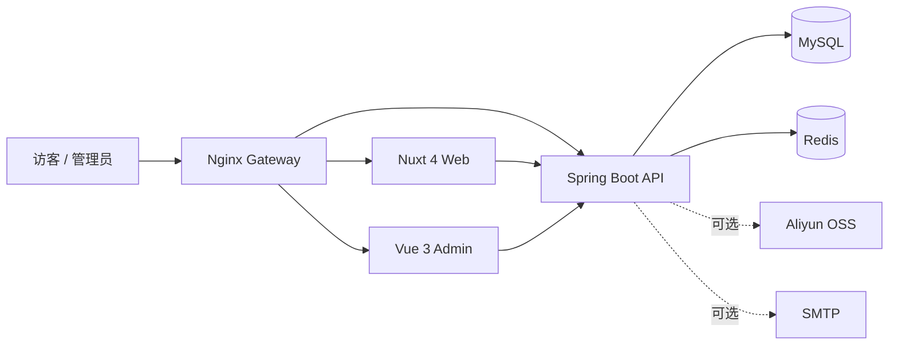

# Wineclouds’Blog

一个面向个人创作、内容管理与长期运维的全栈博客系统。

项目由 **Nuxt 4 SSR 公开站**、**Vue 3 管理端**和 **Spring Boot API** 组成。公开站采用 Windows 11 Fluent Design 风格，以响应式毛玻璃界面、明暗主题和沉浸式壁纸呈现内容；管理端覆盖文章、分类、标签、评论、媒体、统计与审计等日常工作流。

## 项目亮点

- **统一的 Fluent 视觉体验**：毛玻璃模块、明暗主题、响应式布局、移动端导航与减少动画偏好支持。
- **完整的内容工作流**：文章草稿、自动保存、Markdown 预览、定时发布、撤回、归档、置顶与乐观锁。
- **丰富的内容发现能力**：分类、标签、搜索、时间归档、上一篇/下一篇、RSS、Sitemap 与 robots.txt。
- **公开互动与后台治理**：匿名点赞、两级评论、重复提交防护、评论审核、垃圾标记和管理员回复。
- **媒体与通知能力**：阿里云 OSS 上传、图片引用保护、孤儿媒体清理和邮件通知 Outbox。
- **可观测且可维护**：PV/UV 统计、热门文章、管理仪表盘、操作日志、健康检查与 Prometheus 指标。
- **面向生产的安全设计**：JWT、Refresh Cookie Rotation、会话撤销、限流、验证码、CSP、HSTS 和敏感信息保护。
- **可复现部署**：Docker Compose、Nginx 网关、Flyway 迁移、版本化镜像、加密备份与恢复演练脚本。

## 系统架构



| 模块 | 技术栈 | 职责 |
| --- | --- | --- |
| 公开站 | Nuxt 4、Vue 3、TypeScript | SSR 内容展示、互动、SEO 与订阅输出 |
| 管理端 | Vue 3、Vite、Pinia、Vue Router、Element Plus | 内容编辑、审核、媒体与站点运营 |
| 后端 | Java 25、Spring Boot 4.1、MyBatis、Flyway | REST API、鉴权、业务逻辑与数据访问 |
| 数据层 | MySQL 9.7、Redis 8.8 | 持久化、缓存、统计计数与会话状态 |
| 网关与部署 | Nginx、Docker Compose | 域名路由、TLS、容器编排与健康检查 |

## 快速开始

### 环境要求

- Docker Desktop 29+ 或 Docker Engine
- Docker Compose

### 1. 创建本地配置

```powershell
Copy-Item .env.example .env
```

首次启动前，请至少修改以下变量：

| 变量 | 用途 |
| --- | --- |
| `MYSQL_PASSWORD` | 应用连接 MySQL 的密码 |
| `MYSQL_ROOT_PASSWORD` | MySQL root 密码 |
| `REDIS_PASSWORD` | Redis 密码 |
| `JWT_SECRET` | JWT 签名密钥，至少 32 字节 |
| `ADMIN_INITIAL_USERNAME` | 首次创建的管理员用户名 |
| `ADMIN_INITIAL_PASSWORD` | 首次创建的管理员密码，至少 12 位 |

> `ADMIN_INITIAL_USERNAME` 和 `ADMIN_INITIAL_PASSWORD` 仅在用户表为空时生效。管理员创建成功后，请从环境配置中删除这两个值并重建 Backend 容器。

### 2. 启动全部服务

```powershell
docker compose up --build -d
docker compose ps
```

首次启动会构建 Web、Admin 和 Backend 镜像，并由 Flyway 自动完成数据库迁移。

### 3. 打开应用

| 服务 | 地址 |
| --- | --- |
| 公开站 | <http://localhost/> |
| 管理端 | <http://admin.localhost/> |
| 管理员登录 | <http://admin.localhost/login> |
| API 状态 | <http://localhost/api/v1/status> |
| Swagger UI | <http://localhost/docs> |
| 健康检查 | <http://localhost/actuator/health> |

端口 `80` 被占用时，可在 `.env` 中设置 `HTTP_PORT=8088`，然后通过 `http://localhost:8088/` 访问。

停止服务：

```powershell
docker compose down
```

如需同时删除本地 MySQL 和 Redis 数据，请确认数据不再需要后执行：

```powershell
docker compose down -v
```

## 本地开发

脱离应用容器开发时，还需要：

- Node.js 24、npm 11
- JDK 25、Maven 3.9+
- Docker（用于 MySQL、Redis 和 Testcontainers）

安装前端依赖：

```powershell
npm ci
```

启动公开站和管理端：

```powershell
npm run dev:web
npm run dev:admin
```

后端可在 IDE 中导入 `backend/pom.xml` 并运行 `BlogApplication`。建议仅通过 Docker 启动依赖服务：

```powershell
docker compose up -d mysql redis
```

开发环境使用与 Docker Compose 相同的 MySQL、Redis 和鉴权配置；敏感值仅保存在本地 `.env` 中。

## 可选集成

### Aliyun OSS

配置 `OSS_REGION`、`OSS_ENDPOINT`、`OSS_BUCKET`、`OSS_ACCESS_KEY_ID` 和 `OSS_ACCESS_KEY_SECRET` 后可启用媒体上传。建议使用只允许访问目标 Bucket 与 `OSS_OBJECT_PREFIX` 的最小权限 RAM 用户。

未配置 OSS 时，文章、分类、标签和评论等核心功能仍可使用。

### SMTP

设置 `MAIL_ENABLED=true`，并配置 `MAIL_HOST`、`MAIL_PORT`、`MAIL_USERNAME`、`MAIL_PASSWORD` 和 `MAIL_FROM`，即可启用评论回复邮件通知。

## 生产部署

项目提供单机 Docker Compose 生产方案，支持 HTTPS、安全 Cookie、容器日志轮换、只读 Backend 根文件系统、健康检查和版本化镜像。

1. 将 TLS 证书放入 `deploy/certs/fullchain.pem` 和 `deploy/certs/privkey.pem`。
2. 复制生产配置模板并替换域名、密码与密钥：

   ```bash
   cp .env.production.example .env.production
   ```

3. 校验 Compose 配置并执行首次发布：

   ```bash
   docker compose --env-file .env.production \
     -f docker-compose.yml -f docker-compose.prod.yml config --quiet
   bash deploy/scripts/deploy.sh 0.1.0
   ```

生产密钥只应保存在部署环境中，禁止提交 `.env` 或 `.env.production`。`deploy/scripts/` 提供版本发布、MySQL 加密备份、恢复和冒烟检查脚本。

## 常用质量命令

```powershell
# Frontend unit tests
npm test

# TypeScript type checking
npm run typecheck

# Web and Admin production builds
npm run build

# Backend verification
Set-Location backend
mvn verify
```

仓库的根级 `package.json` 还提供 E2E、OpenAPI、Lighthouse 和 k6 命令，可按发布需要单独执行。

## 项目结构

```text
.
├── backend/                  Spring Boot API、Flyway 与 MyBatis Mapper
├── frontend/
│   ├── web/                  Nuxt SSR 公开站
│   ├── admin/                Vue 管理端
│   └── packages/api-client/  前端共享 API Client
├── deploy/                   Nginx 配置、部署与备份脚本
├── docker-compose.yml        本地完整环境
└── docker-compose.prod.yml   单机生产覆盖配置
```

## 致谢

项目的功能范围与视觉方向参考了 MIT License 的 FeiTwnd-Website；本项目未直接复用其代码或资源。
